# RecoFM: Foundation Recommender model

# Tag: **agent-demo-track**
Recent research showed that combining LLM embeddings with graph convolution layers over them results in remarkable zero-shot performance, surpassing traditional graph-based approaches such as LightGCN, and naturally supporting user intention queries.

In this demo, we demonstrate how to build such a system. To showcase its ability, we've chosen the Amazon Movies 2023 dataset. However, the main beauty of this approach is that it can be applied to any type of recommendation data and delivers strong zero-shot performance **without any additional training**.

## Architecture Overview

The system follows a multi-stage pipeline that processes movie data and user current preferences to generate personalized recommendations:

[//]: # (```mermaid)

[//]: # (graph TD)

[//]: # (    %% ========================)

[//]: # (    %% Data Preparation Section)

[//]: # (    %% ========================)

[//]: # (    A["📽️ Movie Titles Dataset"] --> B["Mistral LLM Embedding<br/>&#40;Text Representation&#41;"])

[//]: # (    B --> C["Graph Convolution Layers<br/>&#40;Relationship Learning&#41;"])

[//]: # (    C --> D["🔗 Graph-Enhanced Embeddings"])

[//]: # (    )
[//]: # (    %% ========================)

[//]: # (    %% User Input Section)

[//]: # (    %% ========================)

[//]: # (    F["🎬 User's Liked Movies"] --> G["User Preference Profile<br/>&#40;Average of Graph-Enhanced<br/>Movie Embeddings&#41;"])

[//]: # (    H["🔍 Natural Language Query<br/>&#40;e.g. 'funny sci-fi movies'&#41;"] --> I["Query Embedding"])

[//]: # (    G --> J["🧩 Combined User Vector"])

[//]: # (    I --> J)

[//]: # (    )
[//]: # (    %% ========================)

[//]: # (    %% System Flow)

[//]: # (    %% ========================)

[//]: # (    D --> K["📊 Similarity Matching"])

[//]: # (    J --> K)

[//]: # (    K --> L["🏆 Top 100 Candidates"])

[//]: # (    L --> M["🤖 AI Agent Ranking<br/>&#40;Context-Aware Filtering&#41;"])

[//]: # (    M --> N["🎯 Final Recommendations<br/>&#40;Top 10 Movies&#41;"])

[//]: # (    )
[//]: # (    %% ========================)

[//]: # (    %% Visual Grouping)

[//]: # (    %% ========================)

[//]: # (    subgraph "Data Preparation Pipeline")

[//]: # (        A)

[//]: # (        B)

[//]: # (        C)

[//]: # (        D)

[//]: # (    end)

[//]: # (    )
[//]: # (    subgraph "User Understanding")

[//]: # (        F)

[//]: # (        H)

[//]: # (        G)

[//]: # (        I)

[//]: # (        J)

[//]: # (    end)

[//]: # (    )
[//]: # (    subgraph "Two-Stage Retrieval")

[//]: # (        K)

[//]: # (        L)

[//]: # (    end)

[//]: # (    )
[//]: # (    subgraph "Intelligent Ranking")

[//]: # (        M)

[//]: # (        N)

[//]: # (    end)

[//]: # (    )
[//]: # (    %% ========================)

[//]: # (    %% Styling)

[//]: # (    %% ========================)

[//]: # (    style A fill:#e1f5fe,stroke:#039be5)

[//]: # (    style N fill:#c8e6c9,stroke:#2e7d32)

[//]: # (    style K fill:#fff3e0,stroke:#fb8c00)

[//]: # (    style M fill:#fce4ec,stroke:#e91e63)

[//]: # (    )
[//]: # (    classDef data fill:#e1f5fe,stroke:#039be5)

[//]: # (    classDef result fill:#c8e6c9,stroke:#2e7d32)

[//]: # (    classDef process fill:#fff3e0,stroke:#fb8c00)

[//]: # (    classDef ai fill:#fce4ec,stroke:#e91e63)

[//]: # (    )
[//]: # (    class A data)

[//]: # (    class N result)

[//]: # (    class K,L process)

[//]: # (    class M ai)

[//]: # (```)

<!--  -->


### Pipeline Stages

#### 1. Preprocessing Stage
- **Movie Title Processing**: Raw movie titles are converted into semantic embeddings using Mistral AI
- **Graph Convolution Enhancement**: Movie embeddings are enriched through Graph Convolution Layers (GCL) that capture user interaction patterns and movie relationships

#### 2. User Input Processing  
- **Movie Selection Encoding**: User-selected movies are converted into collaborative embeddings
- **Natural Language Understanding**: User query is processed through Mistral AI to create a query embedding
- **Preference Fusion**: Movie selections and text queries are combined using a weighted approach (α parameter)

#### 3. Retrieval Phase
- **Similarity Computation**: Cosine similarity is calculated between a combined user vector and all candidate movie embeddings
- **Candidate Selection**: Top 100 most similar movies are retrieved as candidates

#### 4. Ranking Phase
- **AI Agent Ranking**: An intelligent agent analyzes the top 100 candidates considering user preferences, viewing history, and context
- **Final Selection**: The agent selects and ranks the final top 10 personalized recommendations

## Features

### Dual Embedding Types

- **Pure Language Model (LLM) Embeddings**  
  Generated for each movie title using Mistral AI.

- **Graph-Enhanced Embeddings (LLM + GCL)**  
  Combines language understanding with user interaction patterns to enrich the embeddings.

---

### Hybrid Input

- **Movie Selection**  
  Select movies you've previously enjoyed.

- **Natural Language Query**  
  Describe the kind of movie you're looking for in natural language.

- **Weight Adjustment (α)**  
  Adjust the balance between your movie selections and your text description to personalize the recommendations.

---

### Key Technical Components

- **Mistral AI Integration**: Leverages Mistral's language models for both movie title understanding and user query processing
- **Graph Convolutional Networks**: Enhances embeddings by incorporating collaborative filtering signals through user-movie interaction graphs  
- **Hybrid Recommendation Strategy**: Combines content-based (semantic similarity) and collaborative filtering approaches
- **Intelligent Ranking**: Uses an AI agent for context-aware final ranking that goes beyond simple similarity scores
## Requirements

1. Python 3.8+
2. Virtual environment (recommended)
3. Mistral AI API key (get one at https://console.mistral.ai/)

Install the required packages:

```bash
pip install -r requirements.txt
```

## Environment Setup

1. Create a `.env` file in the project root:
```bash
MISTRAL_API_KEY=your_api_key_here
```

2. Ensure you have the necessary data files in the `amazon_movies_2023` directory:
   - `title_embeddings.npz`: Movie title embeddings from Mistral AI
   - `gcl_embeddings.npz`: Graph-enhanced embeddings
   - `title_embeddings_mapping.csv`: Movie metadata mapping

## Usage

1. Activate your virtual environment:
```bash
source venv/bin/activate  # On Unix/macOS
```

2. Run the recommender app:
```bash
python movie_recommender_app.py
```

3. Open your browser to the local URL shown in the terminal (typically http://127.0.0.1:7860)

## How It Works

1. **Movie Selection:**
   - Search and select up to 5 movies you've enjoyed
   - The system uses these as a baseline for your taste

2. **Text Preferences:**
   - Describe what you're looking for (e.g., "A thrilling sci-fi movie with deep philosophical themes")
   - Your description is converted to embeddings using Mistral AI

3. **Preference Weighting:**
   - Use the α slider to balance between your selected movies and text description
   - α = 0: Only use movie history
   - α = 1: Only use text description
   - Values in between combine both signals

4. **Embedding Types:**
   - LLM: Pure language model embeddings for semantic understanding
   - LLM + GCL: Graph-enhanced embeddings that also consider user interaction patterns

## Data Processing

For information about the dataset processing pipeline, see [DATA_PROCESSING.md](DATA_PROCESSING.md)

## Contributing

Feel free to open issues or submit pull requests with improvements! 